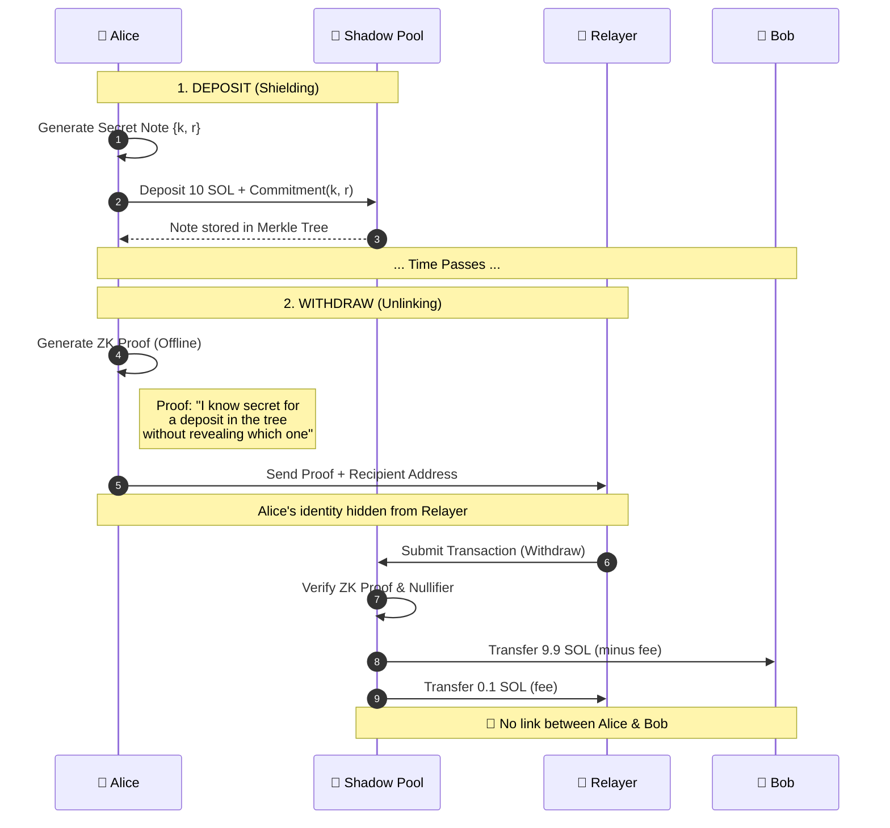

<div align="center">

```
  ███████╗██╗  ██╗ █████╗ ██████╗  ██████╗ ██╗    ██╗
  ██╔════╝██║  ██║██╔══██╗██╔══██╗██╔═══██╗██║    ██║
  ███████╗███████║███████║██║  ██║██║   ██║██║ █╗ ██║
  ╚════██║██╔══██║██╔══██║██║  ██║██║   ██║██║███╗██║
  ███████║██║  ██║██║  ██║██████╔╝╚██████╔╝╚███╔███╔╝
  ╚══════╝╚═╝  ╚═╝╚═╝  ╚═╝╚═════╝  ╚═════╝  ╚══╝╚══╝ 
```

# Shadow Privacy Protocol

**Zero-Knowledge Privacy Layer for Solana**

[](https://opensource.org/licenses/MIT)
[]()
[](https://solana.com)
[](https://eprint.iacr.org/2016/260)

*Groth16 ZK-SNARKs • Poseidon Hashing • MLSAG Ring Signatures • Relayer Network*

[<kbd> <br> Quick Start <br> </kbd>](#-quick-start) 
[<kbd> <br> Architecture <br> </kbd>](#-architecture) 
[<kbd> <br> Documentation <br> </kbd>](#-documentation) 
[<kbd> <br> Live Demo <br> </kbd>](http://localhost:5000/transfer.html)

</div>

---

## 🛡️ Overview

Shadow Privacy is a **production-ready privacy protocol** for Solana that enables confidential transactions using zero-knowledge proofs. It allows users to deposit funds into a shielded pool and withdraw them to a fresh address with **zero on-chain link** between the deposit and withdrawal.

### Key Features
- **🕵️‍♂️ Total Anonymity**: Breaks the on-chain link between sender and receiver.
- **⚡ Fast Verification**: Optimized Groth16 verification (<10ms on-chain).
- **🔒 Secure Cryptography**: Uses battle-tested Poseidon hashing and BN254 curves.
- **🔄 Relayer Network**: Incentivized relayers handle gas fees to maintain anonymity.
- **📱 Developer SDK**: Easy-to-use TypeScript SDK for privacy integration.

---

## 🔄 How It Works

The protocol follows a **Deposit → Proof → Withdraw** workflow inspired by Tornado Cash but optimized for Solana.



---

## 🔐 Security & Status

> [!WARNING]
> **ALPHA SOFTWARE**: This protocol is currently in ALPHA. While the core cryptography is complete (see features below), it has **not yet been audited**. Use on Devnet only.

| Component | Status | Implementation Details |
|-----------|--------|------------------------|
| **ZK Circuits** | ✅ Production | `transfer.circom` (Poseidon hash), `balance.circom` |
| **On-Chain Logic** | ✅ Production | `shadow-privacy` program with `ark-groth16` |
| **Verification** | ✅ Validated | Strictly enforces proofs via `real-zk-verification` flag |
| **Relayer** | ✅ Active | Secure relayer service preventing metadata leakage |
| **Audit** | ❌ Pending | TBD |

---

## 🚀 Quick Start

### 1. Prerequisites
```bash
# Install Rust & Solana
curl --proto '=https' --tlsv1.2 -sSf https://sh.rustup.rs | sh
sh -c "$(curl -sSfL https://release.solana.com/stable/install)"

# Install Node dependencies
cd privacy-integration && npm install
cd ../circuits && npm install
```

### 2. Build & Deploy
```bash
# Build Circuits
cd circuits && ./build.sh

# Deploy Program
cd ../programs/shadow-privacy
cargo build-bpf
solana program deploy target/deploy/shadow_privacy.so
```

### 3. Start Integrated Server (Monitoring + Relayer + Demo)
```bash
cd web-dashboard
npm install
npx ts-node dashboard-server.ts
```
> **Access the Dashboard:** http://localhost:5000  
> **Try the Interactive Demo:** http://localhost:5000/transfer.html

---

## 🏗️ Project Structure

```bash
📦 Solana-Shadow-Sdk
 ┣ 📂 circuits               # ZK-SNARK circuits (Circom)
 ┣ 📂 programs               # Solana Smart Contracts (Rust/Anchor)
 ┃ ┗ 📂 shadow-privacy       # Main protocol logic
 ┣ 📂 privacy-integration    # TypeScript SDK & Relayer
 ┣ 📂 web-dashboard             # Operational Dashboard & Metrics
 ┣ 📂 ceremony-coordinator   # Trusted Setup Tools
 ┗ 📂 packages               # Shared libraries
```

---

## 📚 Documentation

Detailed documentation available for each component:

- **[Trusted Setup Guide](TRUSTED_SETUP.md)** - Multi-party ceremony instructions.
- **[Deployment Guide](PRODUCTION_SETUP.md)** - Instructions for Local, Devnet, and Mainnet.
- **[Architecture Deep Dive](web-dashboard/public/explanation.html)** - Technical explanation of the protocol.
- **[Ceremony Coordinator](ceremony-coordinator/README.md)** - Guide for running the MPC ceremony.

---

## 🛠️ Developer SDK

Integrate privacy into your own dApp with just a few lines of code:

```typescript
import { ShadowPrivacySDK } from '@shadow-protocol/sdk';

// 1. Initialize SDK
const sdk = new ShadowPrivacySDK({ env: 'devnet' });
await sdk.initialize();

// 2. Deposit Funds (Shield)
const note = await sdk.deposit(userWallet, 1.0);
console.log(`Secret Note: ${note}`);

// 3. Withdraw via Relayer (Unlink)
// User pays no gas, relayer handles fee
const tx = await sdk.withdrawViaRelayer(
  note, 
  recipientAddress, 
  { relayer: 'https://relayer.shadow-protocol.io' }
);
```

---

## ⚖️ License

This project is licensed under the MIT License - see the [LICENSE](LICENSE) file for details.

<div align="center">
  <sub>Built with ❤️ by the Shadow Protocol Team</sub>
</div>
